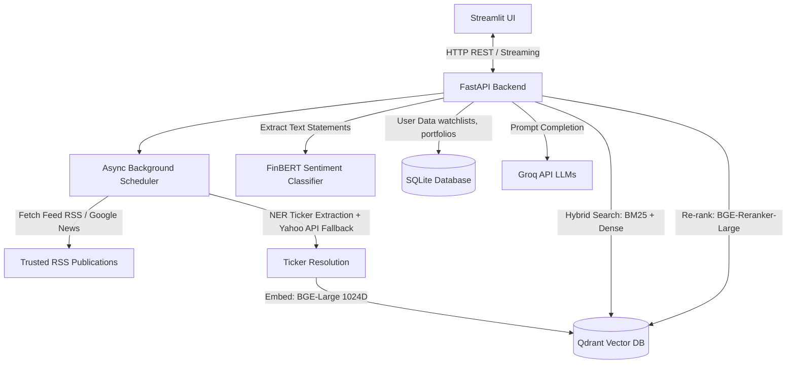

# 📈 FinSight: Real-Time Financial RAG & Intelligence Engine

FinSight is a high-fidelity **Financial Retrieval-Augmented Generation (RAG)** application designed to convert raw financial news and filings into actionable investment intelligence. 

By combining hybrid semantic retrieval, cross-encoder re-ranking, sentiment analysis, and LLM reasoning, FinSight helps investors cut through the noise and analyze market movements.

---

## 🌟 What is FinSight?

Imagine having a private team of financial analysts crawling news feeds, calculating sentiment shifts for your portfolio, tracing macro events, and writing comprehensive summaries—all in real-time. That is FinSight.

Unlike generic search engines or stock trackers, FinSight doesn't just return links or raw metrics. It retrieves financial contexts from trusted publications, measures per-ticker sentiment using specialized AI, computes your portfolio's exposure risk, and answers complex questions with cited sources.

---

## 🚀 Key Features

* **💬 Smart Financial RAG Chat**: Ask complex market questions. FinSight retrieves context across its index, filters out irrelevant results, cites exact articles, and streams LLM answers using Groq (Llama 3.3, Llama 3.1, Mixtral).
* **📰 Real-Time Trusted Ingestion**: Automatically crawls 17+ high-credibility feeds (Economic Times, Livemint, Business Standard, RBI, SEBI, and exchange announcements).
* **🎯 Advanced Ticker Resolution**: Automatically extracts stock symbols from raw text (via exchange suffixes, prefixes, and entity matching) and uses a Yahoo Finance API search fallback to resolve unknown symbols.
* **🎭 Sentiment Consensus**: Analyzes ticker-specific sentiments using **FinBERT** (`ProsusAI/finbert`) and clusters opinions by publisher to present a source consensus metric (e.g., *"Reuters is Bullish, CNBC is Neutral, Consensus: 70% Bullish"*).
* **💼 Portfolio & Watchlist Intelligence**: Save your holdings and allocations to calculate custom **Estimated Sentiment Shifts** and generate daily, watchlisted briefing summaries.
* **🕸️ Event Impact Propagation**: Visually map causal chain flows for macroeconomic factors or market events (e.g., `Crude Oil Surge` ➔ `Airline costs rise` ➔ `Margins shrink` ➔ `Airline stocks decline`).
* **📈 Historical Benchmarks & RAG Validation**: Run evaluation suites checking Retrieval (Hit Rate, Precision, MRR, NDCG) and Generation (using Ragas for Faithfulness, Relevance, and Completeness).

---

🔗 **Live Demo**: [Click here to access the live application](https://finsight.streamlit.app)  
*(Frontend dashboard deployed on Streamlit Community Cloud, connected to a FastAPI backend hosted on GCP Cloud Run, and a vector database hosted on Qdrant Cloud).*

---

## 🏗️ Architecture & Technology Stack

FinSight is built with a decoupled architecture where the Streamlit UI communicates exclusively via REST APIs with the FastAPI backend:



### Technical Stack Details
* **Frontend**: Streamlit + Plotly (for interactive visualizations).
* **Backend**: FastAPI + AsyncIOScheduler (background crawlers run every 10 mins).
* **Vector Database**: Qdrant (local file-storage).
* **Relational Database**: SQLite (for Watchlists and Portfolio Holdings).
* **Embeddings Model**: `BAAI/bge-large-en-v1.5` (1024-dimension dense vectors).
* **Re-ranking Model**: `BAAI/bge-reranker-large` (Cross-Encoder Candidate Scorer).
* **Sentiment Model**: `ProsusAI/finbert` (Specialized finance classification).
* **LLM Engine**: Groq Client (`llama-3.3-70b-versatile`, `llama-3.1-8b-instant`, `mixtral-8x7b-32768`).

---

## 📂 Project Directory Structure

```text
FinSight/
├── api/                  # FastAPI Backend API Layer
│   ├── llm.py            # Groq API wrappers & generation scripts
│   └── main.py           # FastAPI server endpoints & routers
├── ui/                   # Streamlit Frontend Layer
│   ├── api_client.py     # Frontend client communicating with FastAPI
│   └── app.py            # Streamlit dashboard UI code
├── ingestion/            # Data Fetching & Vector Ingestion
│   ├── company_seed.py   # Seed company mappings for entity resolution
│   ├── embedder.py       # Embeds text (BGE-Large) and saves to Qdrant
│   └── rss_fetcher.py    # RSS Feed crawling & Ticker extraction
├── retrieval/            # Hybrid Search, Reranking & Databases
│   ├── cache_utils.py    # Memory cache decorator with Time-To-Live (TTL)
│   ├── hybrid_search.py  # BM25 + Qdrant Dense RRF + BGE Reranker
│   ├── query_expansion.py# Entity-aware semantic query expansion
│   ├── sentiment.py      # Ticker statement classifier (FinBERT)
│   ├── vector_store.py   # Qdrant client utility wrappers
│   └── watchlist_db.py   # SQLite db helper for watchlist/portfolio
├── evaluation/           # Benchmarking & Validation Suite
│   ├── evaluator.py      # Core evaluation runner (retrieval + QA test runner)
│   ├── ground_truth.py   # Curated Q&A dataset for system evaluation
│   └── metrics.py        # Implementation of ranking and QA score calculations
├── scripts/              # Verification & Utilities
│   ├── generate_synthetic_eval.py
│   └── test_pipeline.py  # End-to-end integration tests
├── config.py             # Global Pydantic environment configurations
└── requirements.txt      # Python dependencies list
```

---

## 🏃 How to Run the Project (Step-by-Step)

### 1. Prerequisites
Make sure you have **Python 3.11+** installed. You will also need a **Groq API Key**.

### 2. Installation
Clone the repository, set up a virtual environment, and install dependencies:

```bash
# 1. Create a virtual environment
python -m venv venv

# 2. Activate the virtual environment
# On Windows:
venv\Scripts\activate
# On macOS/Linux:
source venv/bin/activate

# 3. Install requirements
pip install -r requirements.txt
```

### 3. Environment Setup
Create a `.env` file in the root directory and add your API Keys:

```env
GROQ_API_KEY=gsk_your_groq_api_key_here
NEWS_API_KEY=your_optional_news_api_key

# Optional: Add these to test locally against your Qdrant Cloud database
# If left blank/omitted, FinSight defaults to local file-based storage under ./qdrant_db
QDRANT_URL=https://xxxx.gcp.qdrant.io:6333
QDRANT_API_KEY=your_qdrant_api_key
```

### 4. Start the Backend API
Run the FastAPI application. It will automatically initialize the local Qdrant collections and trigger an initial crawler ingestion run if the database is empty:

```bash
uvicorn api.main:app --reload --port 8000
```
*The backend API documentation will be available at `http://127.0.0.1:8000/docs`.*

### 5. Start the Frontend Dashboard
In a new terminal window (with the virtual environment activated), run the Streamlit app:

```bash
streamlit run ui/app.py
```
*The web dashboard will automatically open at `http://localhost:8501`.*

---

## 🧪 Testing & Evaluation

FinSight comes with extensive evaluation tools to monitor retrieval and generation performance:

* **Pipeline Verification**: Test database configuration, feed retrieval, embedding generation, RRF hybrid search, and LLM completions:
  ```bash
  python scripts/test_pipeline.py
  ```
* **Benchmarks & Metrics**: Run the benchmark suite against a ground-truth dataset:
  ```bash
  python -m evaluation.evaluator
  ```

---

## ☁️ Cloud Deployment

FinSight is configured for secure production deployment using **Qdrant Cloud**, **Render**, and **Streamlit Community Cloud**.

### 1. Database Setup (Qdrant Cloud)
1. Sign up on [Qdrant Cloud Console](https://cloud.qdrant.io/) and spin up a **Free Tier Cluster**.
2. Save your **Cluster URL** and generate a **Read-Write API Key**.
3. Temporarily set these variables in your local `.env` file and run `python ingestion/rss_fetcher.py` to seed your cloud database.

### 2. Backend Server Deployment (Render)
1. Push your repository to GitHub (ensure `Dockerfile` and `.dockerignore` are in the root directory).
2. Go to [Render.com](https://render.com) and sign up/log in.
3. Click **New +** $\rightarrow$ select **Web Service**.
4. Connect your GitHub account and select your `FinSight` repository.
5. Configure your settings:
   * **Language**: `Docker` *(Render will automatically find and build your Dockerfile)*
   * **Instance Type**: `Free`
6. Click **Advanced** $\rightarrow$ add these Environment Variables:
   * `GROQ_API_KEY` = `(your Groq API Key)`
   * `QDRANT_URL` = `(your Qdrant Cloud Cluster URL)`
   * `QDRANT_API_KEY` = `(your Qdrant Cloud API Key)`
7. Click **Deploy Web Service** at the bottom. Copy the backend service URL once it is live (e.g., `https://finsight-api.onrender.com`).

### 3. Frontend UI Deployment (Streamlit Community Cloud)
1. Log into [share.streamlit.io](https://share.streamlit.io/) with your GitHub account.
2. Create a **New app** and point it to your repository's `ui/app.py`.
3. In **Settings** $\rightarrow$ **Secrets**, paste:
   ```toml
   FINSIGHT_API_URL = "https://finsight-api.onrender.com"  # Your Render backend URL
   ```
4. Click **Deploy**. Your live dashboard is now securely hosted!
